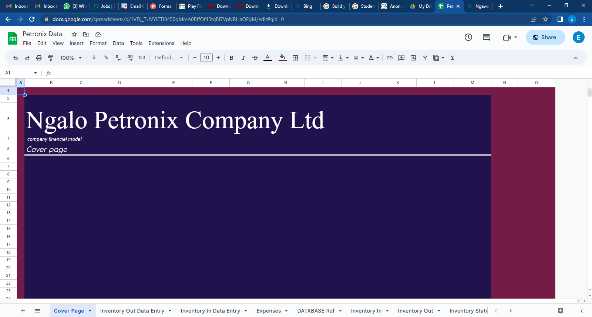

# [Project 1:Fully automated and integrated model]([ https://edutmp.github.io/financial_model_file/](https://www.upwork.com/services/product/consulting-hr-a-fully-integrated-and-automated-financial-model-file-1651955799414988800?ref=project_share&tier=0))
This was my first project on excel. It was quit basic and helpful to the business.
-	5 years raw data was provided by the bakery owner. 
-	The model is created using basic and advanced excel. 
-	No macros and VBA was used in this project. 
-	The objective of this project was to make bring all financial data together making it easier for analysis. 
-	The other objective was to create an automated dashboard that would be easy for end user to analyze cost of inventories. 
-	Objective three was to ensure that there was an automation of financial statements

# Overview of the all features through coverpage

