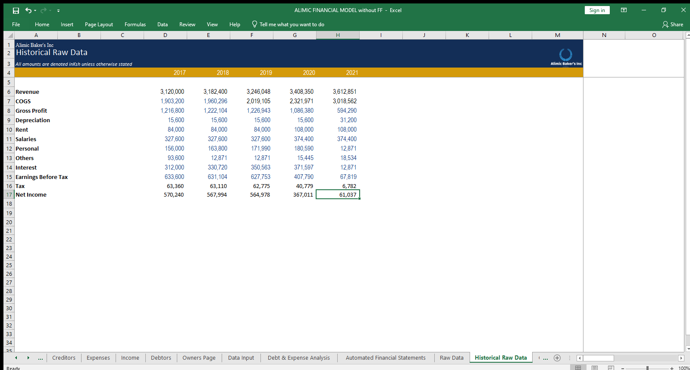
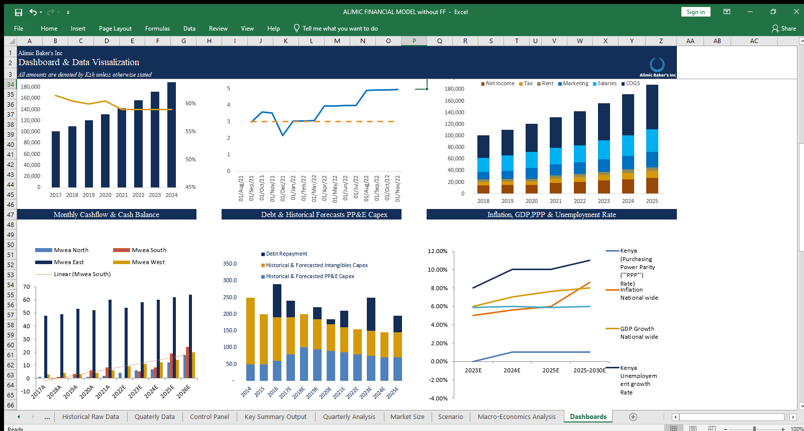

# [Project 1:Fully automated and integrated model](https://www.upwork.com/services/product/consulting-hr-a-fully-integrated-and-automated-financial-model-file-1651955799414988800?ref=project_share&tier=0)
#***Introduction***

This was my first project on excel. It was quite basic and helpful to the business. 
Alimic  business activities include:

- Processing of cakes and other bakery products and selling through physical deliveries
- Selling merchadise and content purchased for resale from third party seller throgh physical delivery.
- Acting as an intermediary between sellers, or service providers to consumers.
- Acting as a trustee between different parties and associates.
- Alimic company was founded in2005 

# Model Overview 
***Raw data provided***

#***Problem Statement***

This company encountered challenges in comprehending the reasons behind its inability to sustain its debt service. The profitability of the business had been gradually declining since 2021. The Chief Executive Officer (CEO) expressed a strong desire to obtain a detailed breakdown of all financial operations from 2017. The CEO sought a projection of the business's performance for the next five years based on observed trends. Additionally, the CEO requested a daily analysis of the company's profit and loss on the financial model.

#***Objectives***

- Import data from physical ledgers.
- Conduct data cleaning and transformation.
- Analyze historical financial trends.
- Provide a 5-year financial forecast for both a pessimistic and optimistic scenario.
- Utilize dashboards to address profit issues, inventory costs, and present market analysis and macroeconomic trends.
- Develop a comprehensive, integrated, and automated model for real-time performance analysis.
- Automate the generation of financial statements.

#***Cover page***

This is an overview of the model from the coverpage.The following page was developed using the following functions: FIND/LEFT/RIGHT/CELL/LENGTH. 
The above functions resulted to the following cover page. The functions listed above are used to make the sheet tittles more dynamic and easy to link using a hyperlink.

#***Dashboard***

Upon completing the data cleaning and transformation process, we were able to identify several financial trends and pinpoint the underlying reasons for the business's poor performance. The company was adversely affected by macroeconomic factors, namely an elevated level of inflation, the ongoing conflict in Ukraine, and the impact of the COVID-19 pandemic. We observed that the substantial profit margins were eroded by the soaring cost of inventory, specifically with regards to oil as the primary contributor, followed by significant price fluctuations in fuel. Additionally, a decline in sales trends became apparent when compared to previous years, primarily attributed to the economic shutdown preceding the onset of the COVID-19 crisis.

#***Daily Analysis***
Daily financial analysis in a business involves a systematic examination of the company's financial data on a day-to-day basis. It is a crucial practice that provides real-time insights into the financial health and performance of the organization. The process typically includes the following key activities:
- The first step involved collecting financial data from various sources, such as sales records, expenses, inventory, cash flow statements, and other relevant financial documents.
- Data Verification and Cleaning: The gathered data is thoroughly verified for accuracy and cleaned to ensure that any errors or inconsistencies are identified and rectified.
I used functions to automate the daily analysis.

