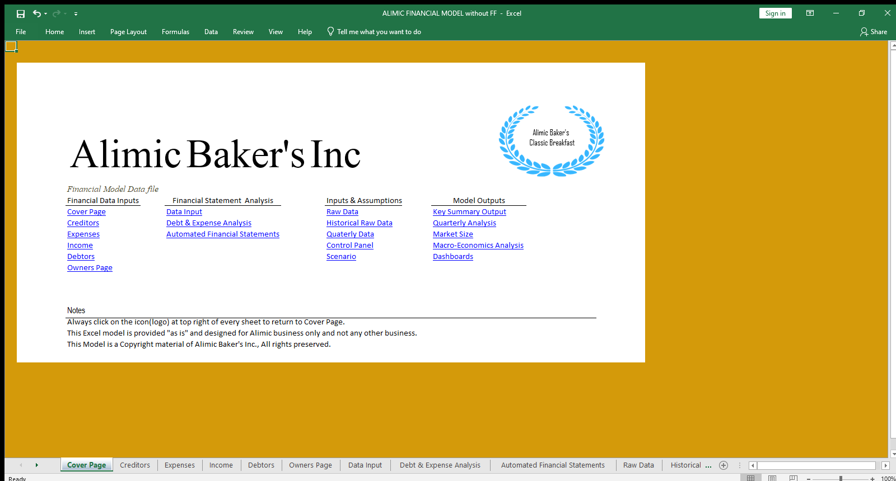

# [Project 1:Fully automated and integrated model](https://www.upwork.com/services/product/consulting-hr-a-fully-integrated-and-automated-financial-model-file-1651955799414988800?ref=project_share&tier=0)
#***Introduction***

This was my first project on excel. It was quite basic and helpful to the business. 
Alimic  business activities include:

- Processing of cakes and other bakery products and selling through physical deliveries
- Selling merchadise and content purchased for resale from third party seller throgh physical delivery.
- Acting as an intermediary between sellers, or service providers to consumers.
- Acting as a trustee between different parties and associates.
- Alimic company was founded in2005 

#***Problem Statement***

This business faced difficulties in acknowledging why it wouldn't continue servicing its debt. Profits seemed to dimmer day by day since year 2021. The C.E.O really wanted a breakdown of every financial activity since 2018. He wanted a forecast of the next five years from the trends observed. He also wanted to see his business analysis in profits and losses on daily basis.

#***Objectives***

- Import data from pysical ledgers
- Clean up and Transform data
- Analyze past financial trends 
- Give 5 year financial forecast at low case scenario and best case sceanrio.
- Using a dashboards solve profit problems and inventory cost, show market analysis, macro-economic trends
- Develop a fully integrated and automated model to make it easier to analyze live performance.
-	Automated financial statements
  
# Model Overview  
This is an overview of the model from the coverpage.

The above page was build by use of LEFT/RIGHT/CELL/LENGTH functions to make it more dynamic in case the sheets names are renamed.
\

